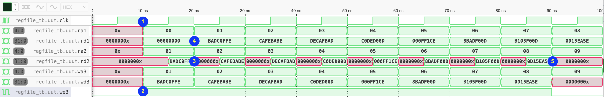

# Testando o banco de registradores do RISC-V 

O objetivo desta simulação é [escrever um test bench](regfile_tb.v) para testar o banco de registradores do RISC-V. Ele possui duas portas de leitura (1 e 2) e uma de escrita (3), totalmente independentes. Para fazer as leituras, são informados os endereços `ra1` e `ra2` (***r**ead **a**ddress*) e retornam os valores `rd1` e `rd2` (***r**ead **d**ata*) respectivamente. A escrita é síncrona na subida do *clk*, para a qual é necessário informar o endereço desejado em `wa3` (***w**rite **a**ddress*), o dado a ser gravado em `wd3` (***w**rite **d**ata*) e ainda habilitar a escrita `we3` (***w**rite **e**nable*). Sua descrição em Verilog está a seguir (note que a questão do registrador `$zero` é tratada nas leituras e não na escrita):

```verilog
module regfile(
    input clk, we3, 
    input [4:0] ra1, ra2, wa3, 
    input [31:0] wd3, 
    output [31:0] rd1, rd2);

    reg [31:0] rf [0:31];

    always@(posedge clk)
        if (we3) 
            rf[wa3] <= wd3;	

    assign rd1 = (ra1 != 0) ? rf[ra1] : 0;
    assign rd2 = (ra2 != 0) ? rf[ra2] : 0;
endmodule
```

O teste consiste em escrever uma [sequência de palavras fornecida](values.tv)  nos registradores de `$x1` a `$x8` e enquanto as lê de volta, respeitando as seguintes regras:
1. Todos os endereços e dados só devem ser modificados nas bordas de **descida** do `clk`;
1. O *write enable* só pode ser ativado durante escritas válidas; 
1. Na porta 2 é lido o mesmo registrador da escrita (note que o valor troca no momento da **subida** do `clk`);
1. Na porta 1 é lido o registrador anterior, gravado um ciclo antes (note que o registrador zero já tem o valor definido);
1. Os demais registradores, que não forem escritos, permanecem indefinidos. 



Você pode informar cada estímulo manualmente ou automatizar com um *loop* `for` ou ainda a cada `@(negedge clk)`. 