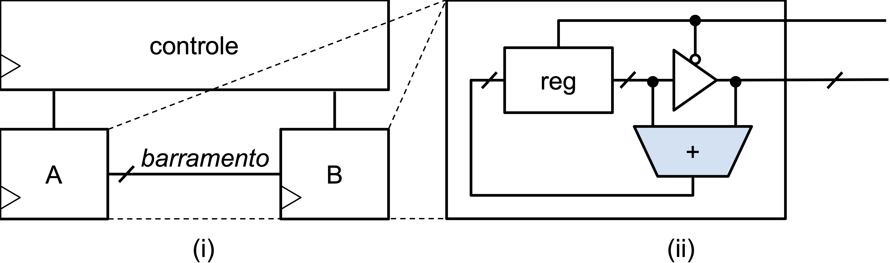
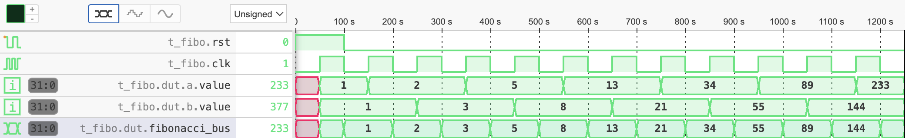

# Gerando a sequência de Fibonacci em um barramento tristate

Usando um barramento compartilhado por meio de *buffers tristate*, projetar um circuito que gere a sequência de Fibonacci de acordo com a especificação a seguir:

 - O circuito deve ser composto de **duas partes idênticas** **A** e **B** – **instâncias de um mesmo módulo**, conforme a figura (i) – e um controle, todos instanciados e/ou gerados no modulo [`top.sv`](top.sv);
 - Cada parte – figura (ii) –- é constituída por: um registrador, um somador e um **buffer tristate**. Recebendo sinais de controle convenientes, cada parte deve ser capaz de:
     1. Receber pelo barramento o valor do outro módulo e somar ao valor armazenado em seu próprio registrador, atualizando-o; 
     1. Enviar (disponibilizar) o valor armazenado em seu próprio registrador pelo mesmo barramento ao módulo oposto; 
 -  As ações acima devem ser realizadas alternadamente pelos dois módulos de forma que a sequência trafegue no barramento, conforme a simulação: 

