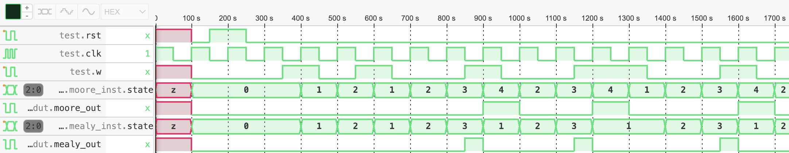

# Maquina de Estados Finitos (Moore vs Mealy)

O objetivo desta prática é construir máquinas de estados finitos para reconhecer a sequência `1-0-0-1`. Você deve criar uma implementação para o modelo de [Moore](moore.sv) e outra para o de [Mealy](mealy.sv). Ambas devem considerar que a sequência pode ser sobreposta, ou seja, `1-0-0-1-0-0-1` deve ser reconhecida duas vezes, conforme a figura a seguir:

Note que a máquina de Mealy é capaz de reconhecer a sequência **antes** da subida do *clock* da última entrada procurada. 
